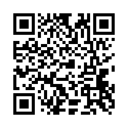

VIDEO DEMO:
https://www.youtube.com/watch?v=w63PZpvq9mA

有時候遇到大家訂飲料 要找 menu / 大家填單 的 小麻煩
開發了 一個 開DIN 訂飲料 聊天機械人

- 查 多家 飲料單
- 打入飲料 歸類 某一家 飲料店（WIT.AI)

- 開團 
-- 分享團號 供大家一起下單
-- 存大家的訂單
-- 飲料 糖 / 冰量 選擇
-- 刪除
-- 分享團號 大家一起下單

其他： 
- YouTube search
- crypto search 
- 天氣特報 /地震報告

- mono-js 做 rest api server 
- 串 LINE SDK nodejs bot 
- witai處理已歸類的字 / 飲料 / 飲料店
- Airtable 做 DB 飲料 / 飲料店 / 單


[](https://line.me/R/ti/p/%40lnl7301g)


Github: https://github.com/kelvin2go/monojs-line-bot

TODO: 
https://trello.com/b/B9hnek8F/%E9%96%8Bdin-line-bot

# monojs-line-bot

Monojs with line bot

## Installation

```bash
npm install
```

## Development

```bash
npm run dev
```

API server will listen on [http://localhost:8000](http://localhost:8000) & watch for changes to restart.

## Production

```bash
npm start
```

## Tests

The tests are made with [AVA](https://github.com/avajs/ava), [nyc](https://github.com/istanbuljs/nyc) and [mono-test-utils](https://github.com/terrajs/mono-test-utils) in `test/`:

```bash
npm test
```
